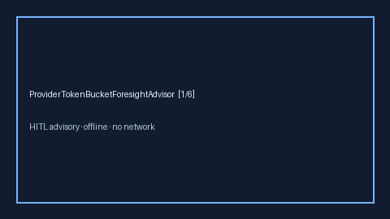

# ProviderTokenBucketForesightAdvisor Guide



Offline advisory token-bucket foresight bands. Closes OpenRouter / LiteLLM /
Portkey foresight gaps.

Optional polish via **GPT-5.5 / Claude Sonnet 4.6 / Gemini 3.x / Kimi K2**.

Distinct from tenant rate limiters and `CostForecastAdvisor`.

## Usage

```python
from safety.provider_token_bucket_foresight import ProviderTokenBucketForesightAdvisor

advice = ProviderTokenBucketForesightAdvisor().advise(
    provider="openai", tokens_remaining=1100.0, forecast_demand=1000.0
)
print(advice.band, advice.ratio)
```
