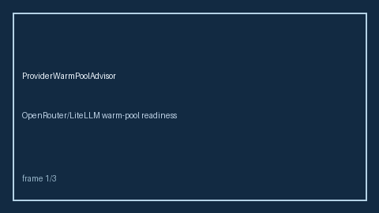

# Provider Warm Pool Advisor Guide



Advise cold/warming/hot bands from warm replica counts vs target. Never
performs network I/O. Closes the OpenRouter / LiteLLM / Portkey warm-pool gap.

Optional later polish via **GPT-5.5 / Claude Sonnet 4.6 / Gemini 3.x / Kimi K2**.

Distinct from `ProviderHealthGuard` and `RequestHedgingAdvisor`.

## Usage

```python
from safety.provider_warm_pool import ProviderWarmPoolAdvisor

advice = ProviderWarmPoolAdvisor().advise("openai", warm_replicas=1, target_replicas=2)
assert advice.band == "warming"
```
