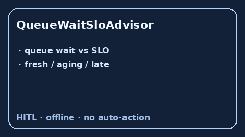

# QueueWaitSloAdvisor Guide



Offline advisory queue-wait SLO bands. Closes OpenRouter / LiteLLM / Portkey
queue-wait gaps.

Optional polish via **GPT-5.5 / Claude Sonnet 4.6 / Gemini 3.x / Kimi K2**.

Distinct from `RequestPriorityAgingAdvisor`.

## Usage

```python
from safety.queue_wait_slo import QueueWaitSloAdvisor

advice = QueueWaitSloAdvisor().advise(request_id="r1", wait_s=3.5, slo_s=5.0)
print(advice.band, advice.ratio)
```
