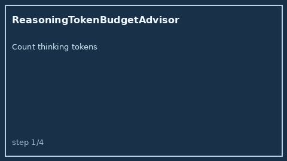

# ReasoningTokenBudgetAdvisor Guide



Offline advisory control for LLM routing. Never performs network I/O.

Optional polish via **GPT-5.5 / Claude Sonnet 4.6 / Gemini 3.x / Kimi K2**.

## Usage

```python
from safety.reasoning_token_budget import ReasoningTokenBudgetAdvisor

advice = ReasoningTokenBudgetAdvisor().advise(
    reasoning_tokens_used=1900,
    reasoning_token_budget=2000,
)
print(advice.band, advice.remaining)
```
