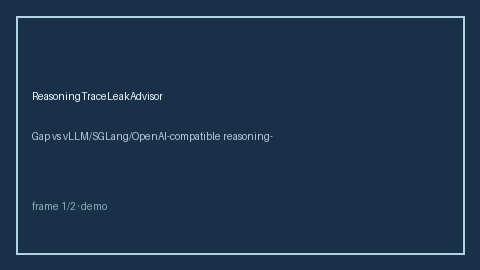

# ReasoningTraceLeakAdvisor Guide



Offline HITL advisor. Never network I/O.

Gap vs vLLM/SGLang/OpenAI-compatible reasoning-trace leak gates. Distinct from `ReasoningTokenBudgetAdvisor` and `PromptInjectionGateway`.

Optional polish via **GPT-5.5 / Claude Sonnet 4.6 / Gemini 3.x / Kimi K2**.

## Usage

```python
from safety.reasoning_trace_leak import ReasoningTraceLeakAdvisor

advice = ReasoningTraceLeakAdvisor().advise(request_id="r1", leak_score=0.1)
print(advice.band)
```

## Safety

Advisory bands only. Humans decide routing actions.
