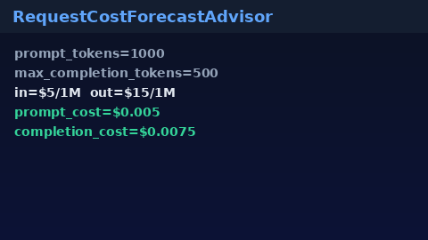

# Request Cost Forecast Guide

Offline USD cost estimates from prompt tokens, max completion tokens, and
$/1M rates — for GPT-5.5 / Claude Sonnet 4.6 / Gemini 3.x / Kimi K2 traffic
**before** dispatch.



## Why

Finance and product often ask "what will this request cost?" before it hits a
provider. LiteLLM and OpenRouter expose cost calculators; Nexus needs an
offline advisor that never mutates spend state and never rejects traffic.

## Distinct from

| Component | Role |
| --- | --- |
| `SpendLedger` | Historical durable spend recording / aggregates |
| `TenantSpendQuotaEnforcer` | Hard monthly USD reject |
| `BudgetGuard` | In-process subject spend cap |
| `RequestCostForecastAdvisor` | Pre-dispatch estimate only (advisory) |

## How it works

1. Construct optionally with default `$ / 1M` input and output rates.
2. Call `forecast(prompt_tokens=..., max_completion_tokens=..., ...)`.
3. Receive `CostForecast` with `estimated_usd`, `prompt_cost`,
   `completion_cost`, and explicit `assumptions` (including
   `assumes_full_max_completion=True`).

Formula:

```text
prompt_cost      = (prompt_tokens / 1e6) * input_usd_per_1m
completion_cost  = (max_completion_tokens / 1e6) * output_usd_per_1m
estimated_usd    = prompt_cost + completion_cost
```

## Example

```python
from safety.cost_forecast import RequestCostForecastAdvisor

advisor = RequestCostForecastAdvisor(
    default_input_usd_per_1m=3.0,
    default_output_usd_per_1m=15.0,
)

forecast = advisor.forecast(
    prompt_tokens=1200,
    max_completion_tokens=800,
    model="gpt-5.5",
)
print(forecast.estimated_usd, forecast.prompt_cost, forecast.completion_cost)
print(forecast.assumptions)
```

## Gap vs LiteLLM / OpenRouter

| Capability | LiteLLM / OpenRouter | Nexus |
| --- | --- | --- |
| Pre-request USD estimate | Yes (hosted calculator) | `RequestCostForecastAdvisor` |
| Prompt / completion split | Yes | `prompt_cost` / `completion_cost` |
| Explicit assumptions | Varies | `assumptions` dict |
| Mutates spend / rejects | Sometimes | Never (advisory only) |
