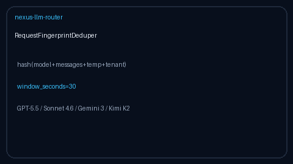

# Request Fingerprint Deduper Guide

In-memory identical-request fingerprint dedup inside a TTL window — for
GPT-5.5 / Claude Sonnet 4.6 / Gemini 3.x / Kimi K2 traffic **before**
dispatch.



## Why

Clients often retry or fan-out the same chat-completion payload without an
`Idempotency-Key`. LiteLLM / Portkey / OpenRouter expose durable idempotency
stores keyed by client headers; Nexus also needs a **content-hash** window
that detects identical bodies when no key is present.

`RequestFingerprintDeduper` is advisory: it never stores response bodies and
never rejects traffic. Callers decide whether to coalesce, shed, or proceed
when `is_duplicate` is true.

## Distinct from

| Component | Role |
| --- | --- |
| `IdempotencyStore` | Durable client `Idempotency-Key` → response replay |
| `RequestFingerprintDeduper` | Short TTL content-hash duplicate detection only |

## How it works

1. Construct with `window_seconds` (default `60`) and optional injectable
   `clock`.
2. `fingerprint(model=..., messages=..., temperature=..., tenant=...)`
   returns a stable SHA-256 hex digest.
3. `observe(fingerprint)` records the hash and returns a
   `FingerprintObservation` with `is_duplicate`, `hits_in_window`, and age.
4. Entries older than the window are evicted on the next observe/size call.
5. `size` / `clear` support introspection and tests.

## Example

```python
from safety.request_fingerprint import RequestFingerprintDeduper

deduper = RequestFingerprintDeduper(window_seconds=30.0)
messages = [{"role": "user", "content": "compare GPT-5.5 and Kimi K2"}]
fp = deduper.fingerprint(
    model="gpt-5.5",
    messages=messages,
    temperature=0.0,
    tenant="acme",
)
first = deduper.observe(fp)
second = deduper.observe(fp)
assert first.is_duplicate is False
assert second.is_duplicate is True
```

## Gap vs LiteLLM / Portkey / OpenRouter

| Capability | LiteLLM / Portkey / OpenRouter | Nexus |
| --- | --- | --- |
| Durable Idempotency-Key replay | Yes | `IdempotencyStore` |
| Content-hash duplicate window | Limited / SaaS | `RequestFingerprintDeduper` |
| Offline / air-gapped | Requires backend | In-memory, no network |
| Frontier model traffic | Yes | GPT-5.5 / Sonnet 4.6 / Gemini 3.x / Kimi K2 |
