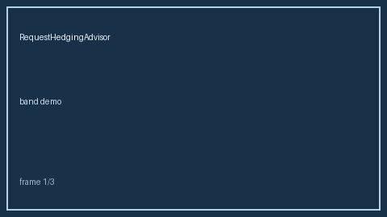

# RequestHedgingAdvisor Guide



advisory hold/hedge/skip bands via wait_ms vs SLO (LiteLLM/Portkey/OpenRouter request-hedging gap; distinct from RequestPriorityAgingAdvisor / FirstTokenLatencySloAdvisor)

Works with **GPT-5.5 / Claude Sonnet 4.6 / Gemini 3.x / Kimi K2**. Never performs network I/O.

## Usage

```python
from safety.request_hedging import RequestHedgingAdvisor
```
