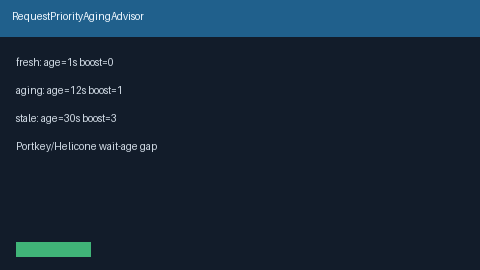

# Request Priority Aging Advisor Guide

Advisory wait-age → priority-boost bands (`fresh` / `aging` / `stale`) from
`age_seconds` — for GPT-5.5 / Claude Sonnet 4.6 / Gemini 3.x / Kimi K2 queue
fairness **before** dequeue.



## Why

Portkey and Helicone surface queue wait-age fairness signals so long-waiting
requests can be promoted. Nexus already has `RequestPriorityLane` for
weighted fair high/normal/bulk dequeue. `RequestPriorityAgingAdvisor` is the
offline **wait-age → boost** advisor: it never mutates a queue — callers apply
`boost`.

## Distinct from

| Component | Role |
| --- | --- |
| `RequestPriorityLane` | Weighted fair high/normal/bulk dequeue queue |
| `RequestPriorityAgingAdvisor` | Wait-age → `fresh` / `aging` / `stale` boost bands |

## How it works

1. Construct with `aging_after_seconds` / `stale_after_seconds` and boosts.
2. Call `advise(age_seconds=..., request_id=...)`.
3. Receive `PriorityAgingAdvice` with `band`, `boost`, and `advisory`.

Bands:

```text
stale  when age_seconds >= stale_after_seconds  → stale_boost
aging  when age_seconds >= aging_after_seconds  → aging_boost
fresh  otherwise                                → 0
```

## Example

```python
from safety.priority_aging import RequestPriorityAgingAdvisor

advisor = RequestPriorityAgingAdvisor(
    aging_after_seconds=5.0,
    stale_after_seconds=30.0,
    aging_boost=1,
    stale_boost=3,
)
advice = advisor.advise(age_seconds=12.0, request_id="gpt-5.5-chat")
assert advice.band == "aging"
print(advice.advisory, advice.boost)
```

## Gap vs Portkey / Helicone

| Capability | Portkey / Helicone | Nexus |
| --- | --- | --- |
| Queue wait-age fairness | Hosted dashboards / policies | `RequestPriorityAgingAdvisor` |
| Boost bands | Varies | Explicit `fresh` / `aging` / `stale` |
| Distinct from lane classes | Often blended | Separate from `RequestPriorityLane` |
| Mutates queue | Sometimes | Never (advisory boost only) |
| Frontier model traffic | Yes | GPT-5.5 / Sonnet 4.6 / Gemini 3.x / Kimi K2 |
