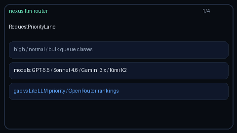

# Request Priority Lane Guide

Weighted fair dequeue across `high` / `normal` / `bulk` request classes for
GPT-5.5 / Claude Sonnet 4.6 / Gemini 3.x / Kimi K2 ingress.



## Why

LiteLLM exposes priority queues and OpenRouter surfaces provider/model
rankings. Nexus already has a `tenant-priority-lanes` *routing strategy* that
changes model choice under pressure. `RequestPriorityLane` is the reusable
**queue** building block: enqueue requests into lane classes and dequeue with
a weighted fair schedule so interactive traffic stays ahead of bulk without
fully starving it.

## How it works

1. Construct with optional `weights` (default `{high: 4, normal: 2, bulk: 1}`).
2. `enqueue(request_id, priority)` appends onto the matching lane.
3. `dequeue()` walks a weighted cycle, skipping empty lanes, and returns a
   `QueuedRequest` (or `None` when idle).
4. `depth` / `snapshot` / `pending` expose queue state for metrics and tests.
5. `clear()` drops pending work and resets the cycle cursor.

## Example

```python
from safety.priority_lane import PriorityClass, RequestPriorityLane

lane = RequestPriorityLane()  # high:normal:bulk = 4:2:1
lane.enqueue("gpt-5.5-interactive", PriorityClass.HIGH)
lane.enqueue("claude-sonnet-4-6-chat", "normal")
lane.enqueue("gemini-3-batch", "bulk")
lane.enqueue("kimi-k2-bulk", "bulk")

while True:
    item = lane.dequeue()
    if item is None:
        break
    dispatch(item.request_id, item.priority)
```

## Gap vs LiteLLM priority / OpenRouter rankings

| Capability | LiteLLM / OpenRouter | Nexus |
| --- | --- | --- |
| Priority queue classes | Yes (priority) | `high` / `normal` / `bulk` |
| Ranking signals | OpenRouter rankings | Distinct; this module is a queue |
| Fair dequeue | Varies | Weighted cycle (default 4:2:1) |
| Anti-starvation | Varies | Empty lanes skipped; bulk still served |
| Routing-strategy cousin | N/A | Distinct from `tenant-priority-lanes` |
| Frontier model traffic | Yes | GPT-5.5 / Sonnet 4.6 / Gemini 3.x / Kimi K2 |
