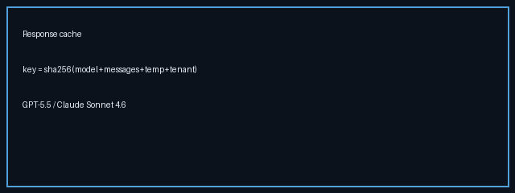

# Response Cache Guide



Exact-match response caching for GPT-5.5 / Claude Sonnet 4.6 / Gemini 3.x /
Kimi K2 traffic. Closes the gap versus LiteLLM and Portkey response caching by
short-circuiting identical chat completions before provider dispatch.

## Why

Gateway fleets often repeat the same prompt (evals, retries, fan-out agents).
LiteLLM and Portkey already expose response caches; Nexus now keeps an
in-memory exact-match cache so duplicate `model + messages + temperature`
requests skip the provider hop.

## How it works

1. Build a SHA-256 key from `model`, normalized messages, `temperature`, and an
   optional tenant namespace (`user` or API key id).
2. On a hit, return the cached `RouterResponse` and increment
   `response_cache_hits_total` — the router engine is not called.
3. On a miss, route and dispatch normally, store the successful response, and
   increment `response_cache_misses_total`.
4. Entries expire after `NEXUS_RESPONSE_CACHE_TTL_SECONDS` (default `300`).

Tenant namespaces keep customer A from reading customer B's completions even
when prompts are identical.

## Configuration

```bash
NEXUS_RESPONSE_CACHE_ENABLED=true
NEXUS_RESPONSE_CACHE_TTL_SECONDS=300.0
```

## Example

```http
POST /v1/chat/completions
Content-Type: application/json

{
  "model": "gpt-5.5",
  "temperature": 0,
  "user": "tenant-a",
  "messages": [{"role": "user", "content": "Summarize refund policy"}]
}
```

The second identical request returns the same completion without calling
OpenAI / Anthropic / Gemini / Moonshot.

## Gap vs LiteLLM / Portkey

| Capability | LiteLLM / Portkey | Nexus |
| --- | --- | --- |
| Exact-match response cache | Yes (Redis/in-memory) | Yes (in-memory + TTL) |
| Tenant namespace | Virtual keys / metadata | Optional tenant key |
| Semantic cache routing | Separate | Existing `semantic-cache` strategy |
| Metrics | Provider-specific | `response_cache_hits_total` / `misses` |
