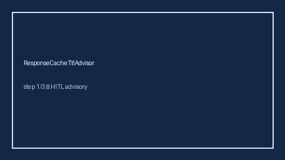

        # ResponseCacheTtlAdvisor Guide

        

        Offline advisory control for LLM routing. Never performs network I/O.

        Optional polish via **GPT-5.5 / Claude Sonnet 4.6 / Gemini 3.x / Kimi K2**.

        ## Usage

        ```python
from safety.response_cache_ttl import ResponseCacheTtlAdvisor

advice = ResponseCacheTtlAdvisor().advise(request_class="stable")
print(advice.band, advice.ttl_seconds)
```

