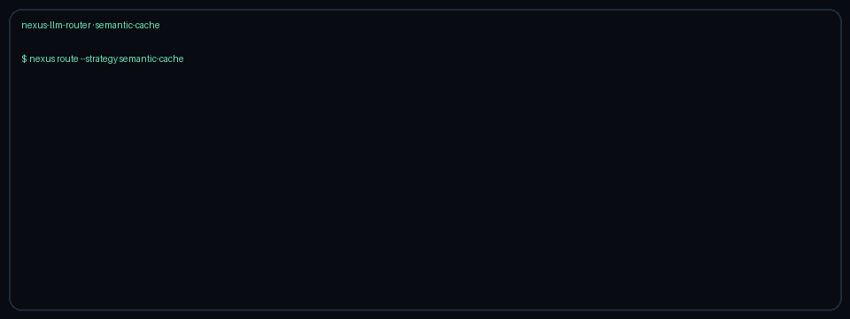

# Semantic-Cache Routing Guide

Use the `semantic-cache` strategy when an upstream semantic cache (Portkey-,
LiteLLM-, or gateway-style) can mark a request as a hit and you want those hits
served by the cheapest eligible model instead of a frontier SKU.

## When to use it

- A semantic cache sets `metadata.cache_hit=true` on embedding/similarity hits.
- Cache hits should prefer cheap/fast catalog models among GPT-5.5, Claude Sonnet
  4.6, Gemini 2.5, and Kimi K2 rather than re-paying frontier rates.
- Cache misses should still follow cost-optimal selection under the configured
  quality floor.

## How it works

1. Read `request.metadata["cache_hit"]` (bool, `1`/`0`, or `"true"`/`"false"`).
2. On a hit: filter to domain-eligible realtime-capable candidates and pick the
   cheapest estimated cost (ties break toward higher quality, then model name).
3. On a miss (or absent metadata): fall through to `cost-optimal` under
   `NEXUS_QUALITY_FLOOR`, then stamp the decision as `semantic-cache`.

## Quick start

```bash
export NEXUS_DEFAULT_STRATEGY=semantic-cache
export NEXUS_QUALITY_FLOOR=0.72
```

Or per request:

```http
X-Router-Strategy: semantic-cache
```

Pass metadata on the internal `RouterRequest`, for example:

```python
RouterRequest(
    request_id="req-1",
    messages=[ChatMessage(content="What is the refund policy?")],
    strategy=RoutingStrategyName.SEMANTIC_CACHE,
    metadata={"cache_hit": True},
)
```

## Demo


