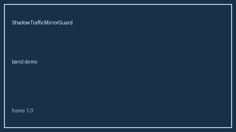

# ShadowTrafficMirrorGuard Guide



shadow mirror off/mirror/full via mirror_pct sampling (Portkey/Helicone/OpenRouter shadow-traffic gap; distinct from ProviderCanaryRolloutGuard)

Works with **GPT-5.5 / Claude Sonnet 4.6 / Gemini 3.x / Kimi K2**. Never performs network I/O.

## Usage

```python
from safety.shadow_traffic import ShadowTrafficMirrorGuard
```
