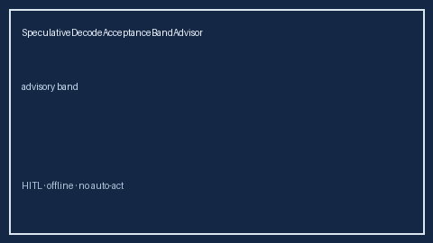

# SpeculativeDecodeAcceptanceBandAdvisor Guide



Closes vLLM / TensorRT-LLM / OpenRouter speculative-decode acceptance-rate bands gaps.

Optional later polish via **GPT-5.5 / Claude Sonnet 4.6 / Gemini 3.x / Kimi K2**.

Distinct from `SpeculativeDecodeAbortAdvisor` and `SpeculativeDecodeBudgetAdvisor`.

## Usage

```python
from safety.speculative_decode_acceptance import SpeculativeDecodeAcceptanceBandAdvisor

advice = SpeculativeDecodeAcceptanceBandAdvisor().advise(request_id="r1", acceptance_rate=0.55)
print(advice.band)
```

## Safety

Advisory only. No HTTP. Humans decide routing changes.
