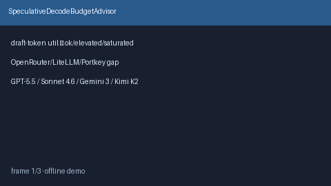

# SpeculativeDecodeBudgetAdvisor Guide



Offline advisory draft-token budget bands for speculative decoding. Never
network I/O. Gap vs OpenRouter / LiteLLM / Portkey speculative-decode routing.

Optional polish via **GPT-5.5 / Claude Sonnet 4.6 / Gemini 3.x / Kimi K2**.

Distinct from `ReasoningTokenBudgetAdvisor` and `OutputTokenCeilingAdvisor`.

## Usage

```python
from safety.speculative_decode_budget import SpeculativeDecodeBudgetAdvisor

advice = SpeculativeDecodeBudgetAdvisor().advise(
    request_id="r1",
    draft_tokens=50,
    max_draft_tokens=64,
)
print(advice.band, advice.utilization)
```
