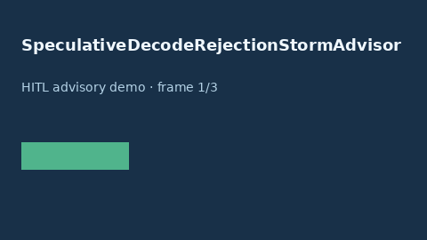

# SpeculativeDecodeRejectionStormAdvisor Guide



Offline HITL advisor. Never network I/O.

Gap vs vLLM/SGLang/TensorRT-LLM speculative-decode rejection-storm advisors. Distinct from ``SpeculativeDecodeAcceptanceBandAdvisor`` and ``SpeculativeDecodeAbortAdvisor``.

Optional polish via **GPT-5.5 / Claude Sonnet 4.6 / Gemini 3.x / Kimi K2**.

## Usage

```python
from safety.speculative_decode_rejection_storm import SpeculativeDecodeRejectionStormAdvisor

advice = SpeculativeDecodeRejectionStormAdvisor().advise(request_id="r1", rejection_rate=0.1)
print(advice.band)
```

## Safety

Advisory only. Humans decide routing actions.
