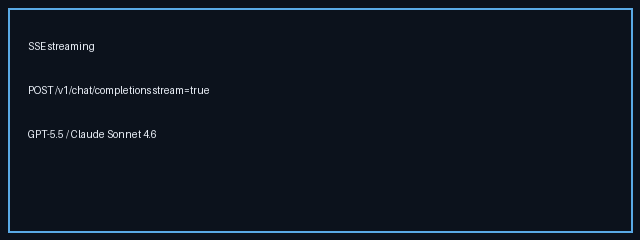

# SSE Streaming Guide



OpenAI-compatible Server-Sent Events (SSE) for `POST /v1/chat/completions`
when `stream=true`. Closes the gap versus OpenRouter / LiteLLM, which stream by
default for GPT-5.5 / Claude Sonnet 4.6 / Gemini 3.x / Kimi K2.

## Why

Token streaming is table stakes for chat UIs. Nexus adapters already exposed
`stream()`; this wires `NexusRouter.complete_stream` and the API path so clients
receive `text/event-stream` chunks instead of a hard 400.

## How it works

1. Request arrives with `"stream": true`.
2. Router selects a model with the configured strategy (same Observe→Decide path).
3. The chosen provider adapter's `stream()` yields text chunks.
4. The API frames each chunk as an OpenAI `chat.completion.chunk` SSE event.
5. A final chunk with `finish_reason=stop` is followed by `data: [DONE]`.

## Example

```bash
curl -N http://localhost:8000/v1/chat/completions \
  -H 'content-type: application/json' \
  -d '{
    "model": "gpt-5.5",
    "stream": true,
    "messages": [{"role": "user", "content": "Write a haiku about routing"}]
  }'
```

## Gap vs OpenRouter / LiteLLM

| Capability | OpenRouter / LiteLLM | Nexus |
| --- | --- | --- |
| `stream=true` SSE | Default | Supported |
| OpenAI chunk schema | Yes | Yes (`chat.completion.chunk`) |
| Routed provider streaming | Yes | Uses adapter `stream()` after routing |
