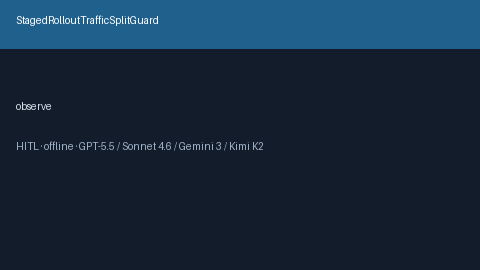

# StagedRolloutTrafficSplitGuard Guide



Offline HITL advisor. Never auto-acts. Closes gaps vs OpenRouter/LiteLLM/BentoML staged rollout traffic-split guards.

Optional later polish via **GPT-5.5 / Claude Sonnet 4.6 / Gemini 3.x / Kimi K2**.

Distinct from `ProviderCanaryRolloutGuard and ShadowTrafficMirrorGuard`.

## Usage

```python
from safety.staged_rollout_traffic_split import StagedRolloutTrafficSplitGuard

advice = StagedRolloutTrafficSplitGuard().check(request_id="r1", canary_share=0.22499999999999998)
print(advice.band)
```

## Safety

No HTTP. Humans decide. See `SAFETY.md`.
