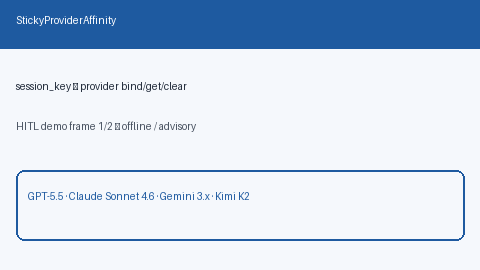

# Sticky Provider Affinity Guide

Session-key → provider sticky map for conversation continuity across
GPT-5.5 / Claude Sonnet 4.6 / Gemini 3.x / Kimi K2 turns.



## Why

Multi-turn chats benefit from staying on the same provider (prompt-cache
warmth, tool-state continuity, consistent billing). LiteLLM, Portkey, and
OpenRouter expose sticky / affinity routing; Nexus needs a reusable
**safety** library map with explicit `get` / `bind` / `clear`.

## Distinct from

| Component | Role |
| --- | --- |
| `ProviderErrorBudgetShed` | Sliding-window error % shed / hard gate |
| Sticky *routing strategies* | In-strategy pin/migrate/expire logic |
| `StickyProviderAffinity` | Library session → provider map only |

## How it works

1. Construct `StickyProviderAffinity()`.
2. After first successful provider selection, `bind(session_key, provider)`.
3. On later turns, `get(session_key)` and prefer that provider when healthy.
4. `clear(session_key)` when the conversation ends or migrates.

## Example

```python
from safety.sticky_provider import StickyProviderAffinity

affinity = StickyProviderAffinity()
affinity.bind("chat-42", "openai")
assert affinity.get("chat-42") == "openai"
affinity.bind("chat-42", "anthropic")  # rebind
assert affinity.clear("chat-42") is True
```

## Gap vs LiteLLM / Portkey / OpenRouter

| Capability | LiteLLM / Portkey / OpenRouter | Nexus |
| --- | --- | --- |
| Session sticky provider | Yes (hosted / config) | `StickyProviderAffinity` (local) |
| Explicit bind / get / clear | Varies | First-class API |
| Independent of error shed | Coupled in some gateways | Distinct from `ProviderErrorBudgetShed` |
| Frontier traffic | Yes | GPT-5.5 / Sonnet 4.6 / Gemini 3.x / Kimi K2 |
