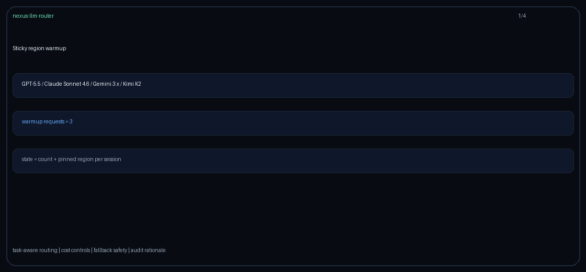

# Sticky-Region-Warmup Routing Guide

Use `sticky-region-warmup` when new sessions should build cache and capacity
warmth in one region before receiving a durable regional pin for GPT-5.5 /
Claude Sonnet 4.6 / Gemini 3.x / Kimi K2 traffic.



## When to use it

- Cold sessions flap between otherwise equivalent regional pools.
- A warmup region should absorb the first few requests.
- Post-warmup requests should keep stable regional and model affinity.

## How it works

1. `StickyRegionWarmupStats` counts decisions and stores a pinned region per
   `session_id`.
2. The first `NEXUS_STICKY_REGION_WARMUP_REQUESTS` requests use
   `metadata.warmup_region`, or the first
   `NEXUS_STICKY_REGION_FAILOVER_PREFERENCES` entry.
3. The next request pins to `request.region`; when absent, a stable session hash
   selects a non-warmup preferred region.
4. Later region hints cannot move the session's pin.
5. Provider health is respected; an unavailable regional pool uses a healthy
   fallback while preserving the session's warmup or pinned state.

## Quick start

```bash
export NEXUS_DEFAULT_STRATEGY=sticky-region-warmup
export NEXUS_STICKY_REGION_WARMUP_REQUESTS=3
export NEXUS_STICKY_REGION_FAILOVER_PREFERENCES=eu,us,cn,global
```

Or per request:

```http
X-Router-Strategy: sticky-region-warmup
```
