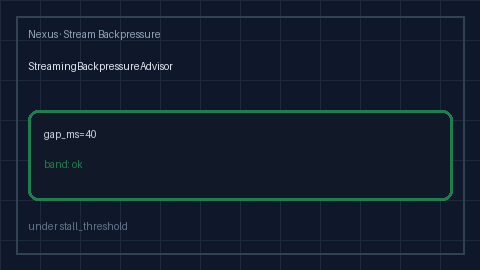

# Streaming Backpressure Advisor Guide

Advisory inter-chunk gap bands (`ok` / `stall` / `backpressure`) for
GPT-5.5 / Claude Sonnet 4.6 / Gemini 3.x / Kimi K2 SSE streams.



## Why

Helicone and LiteLLM surface streaming stall / backpressure signals in hosted
UIs, but offline / air-gapped Nexus gateways still need a process-local
advisor that classifies inter-chunk gaps separately from first-token latency
and hard token budgets. `StreamingBackpressureAdvisor` is advisory only: it
never rejects traffic and never truncates streams.

## Distinct from

| Component | Role |
| --- | --- |
| `StreamingTokenBudgetGate` | Hard mid-stream **token/cost** cut-off |
| `FirstTokenLatencySloAdvisor` | **TTFT / first-token** SLO bands only |
| `StreamingBackpressureAdvisor` | **Inter-chunk gap** stall / backpressure bands |

## How it works

1. Construct with `stall_threshold_ms` (default `250`),
   `backpressure_threshold_ms` (default `1000`), and `window_size` (default `50`).
2. `advise(stream_id=..., gap_ms=...)` returns a one-shot `StreamBackpressureAdvice`
   without mutating state.
3. `record(stream_id, gap_ms)` appends into a bounded deque and returns a rolling
   snapshot (`samples`, `p50_gap_ms`).
4. Bands:
   - `backpressure` when `gap_ms > backpressure_threshold_ms`
   - `stall` when `gap_ms >= stall_threshold_ms`
   - `ok` otherwise
5. `backpressured` / `snapshot` / `streams` / `clear` support ops and tests.

## Example

```python
from safety.stream_backpressure import StreamingBackpressureAdvisor

advisor = StreamingBackpressureAdvisor(
    stall_threshold_ms=200.0,
    backpressure_threshold_ms=800.0,
)

print(advisor.advise(stream_id="gpt-5.5", gap_ms=40.0).band)  # ok
advisor.record("claude-sonnet-4-6", 900.0)
for snap in advisor.backpressured():
    print(snap.stream_id, snap.gap_ms, snap.advisory)
```

## Gap vs Helicone / LiteLLM / OpenRouter

| Capability | Helicone / LiteLLM / OpenRouter | Nexus |
| --- | --- | --- |
| Streaming stall signals | Hosted dashboards | Process-local advisor |
| Inter-chunk gap bands | Alert rules | `ok` / `stall` / `backpressure` |
| Distinct from TTFT / token budget | Often blended | Separate modules |
| Offline / air-gapped | Requires SaaS | In-memory, no network |
| Frontier model traffic | Yes | GPT-5.5 / Sonnet 4.6 / Gemini 3.x / Kimi K2 |
