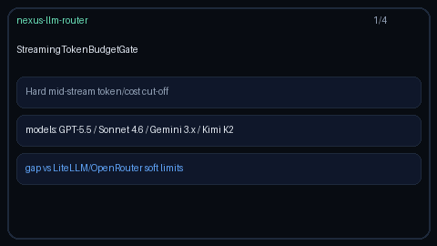

# Streaming Token Budget Guide

Hard mid-stream cut-off by token and/or USD cost budget for GPT-5.5 /
Claude Sonnet 4.6 / Gemini 3.x / Kimi K2 streaming completions.



## Why

LiteLLM and OpenRouter expose soft max-token / soft spend hints that warn or
trim after the fact. Nexus streams OpenAI-compatible SSE chunks; operators
still need a **hard** gate that can stop emitting mid-stream the moment a
token or cost ceiling is crossed. `StreamingTokenBudgetGate` is the reusable
in-process building block for that cut-off.

## How it works

1. Construct with `max_tokens` and/or `max_cost_usd` (at least one required).
2. Call `observe_chunk(tokens=..., cost_usd=...)` after each streamed delta.
3. When cumulative usage meets a ceiling, `exhausted=True` and `allow_continue()`
   returns `False`.
4. Pass `hard_stop=True` (or call `assert_within_budget()`) to raise
   `StreamingTokenBudgetExceededError` for an immediate abort.
5. `reset()` clears counters so one gate instance can guard the next stream.

## Example

```python
from safety.stream_budget import (
    StreamingTokenBudgetExceededError,
    StreamingTokenBudgetGate,
)

gate = StreamingTokenBudgetGate(max_tokens=256, max_cost_usd=0.05)

for chunk in stream_gpt_55_or_sonnet_46():  # GPT-5.5 / Claude Sonnet 4.6 / ...
    try:
        snap = gate.observe_chunk(
            tokens=chunk.completion_tokens,
            cost_usd=chunk.cost_usd,
            hard_stop=True,
        )
    except StreamingTokenBudgetExceededError as exc:
        # hard-stop: close the SSE generator; do not emit further deltas
        print(exc.snapshot.reason)
        break
    else:
        emit_sse(chunk)
```

## Gap vs LiteLLM / OpenRouter

| Capability | LiteLLM / OpenRouter | Nexus |
| --- | --- | --- |
| Soft max-token / spend hints | Yes | Soft limits remain elsewhere |
| Hard mid-stream cut-off | Soft / post-hoc | `StreamingTokenBudgetGate` |
| Token + cost dual ceiling | Varies | `max_tokens` + `max_cost_usd` |
| Raise on breach | Soft warn | `StreamingTokenBudgetExceededError` |
| Reusable per-stream gate | Varies | `observe_chunk` / `reset` |
| Frontier model traffic | Yes | GPT-5.5 / Sonnet 4.6 / Gemini 3.x / Kimi K2 |
