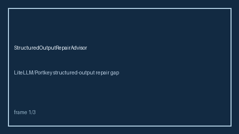

# Structured Output Repair Advisor Guide



Advise accept/repair/fail for structured JSON outputs against required keys.
Never performs network I/O. Closes the LiteLLM / Portkey / OpenRouter structured
output repair gap.

Optional later polish via **GPT-5.5 / Claude Sonnet 4.6 / Gemini 3.x / Kimi K2**.

Distinct from `JsonSchemaRetryGuard` and `OutputSchemaGuard`.

## Usage

```python
from safety.structured_output_repair import StructuredOutputRepairAdvisor

advice = StructuredOutputRepairAdvisor().advise(
    "req-1",
    payload='{"answer": 42}',
    required_keys=("answer", "confidence"),
)
assert advice.band == "repair"
```
