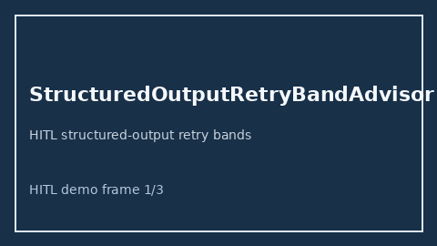

# StructuredOutputRetryBandAdvisor Guide



Offline HITL advisor. Never auto-acts. Closes gaps vs OpenAI/Anthropic/Gemini structured-output retry planners.

Optional later polish via **GPT-5.5 / Claude Sonnet 4.6 / Gemini 3.x / Kimi K2**.

Distinct from ``JsonSchemaRetryBudgetGuard`` and ``AdaptiveRetryJitterAdvisor``.

## Usage

```python
from safety.structured_output_retry_band import StructuredOutputRetryBandAdvisor

advice = StructuredOutputRetryBandAdvisor().advise(request_id="r1", retry_count=3.0)
print(advice.band)
```

## Safety

No HTTP. Humans decide. See `SAFETY.md`.
