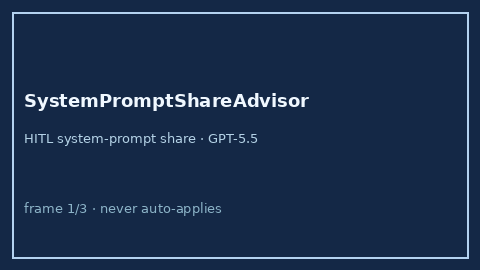

# SystemPromptShareAdvisor Guide



Offline advisory bands for system-prompt share of context. Never network I/O.
Closes OpenRouter / LiteLLM / Portkey system-prompt bloat gaps.

Optional later polish via **GPT-5.5 / Claude Sonnet 4.6 / Gemini 3.x / Kimi K2**.

Distinct from `ContextWindowFitAdvisor` and `PromptCompressionRatioAdvisor`.

## Usage

```python
from safety.system_prompt_share import SystemPromptShareAdvisor

advice = SystemPromptShareAdvisor().advise(
    system_prompt_tokens=12000,
    context_window_tokens=128000,
)
print(advice.band, advice.share_ratio)
```
