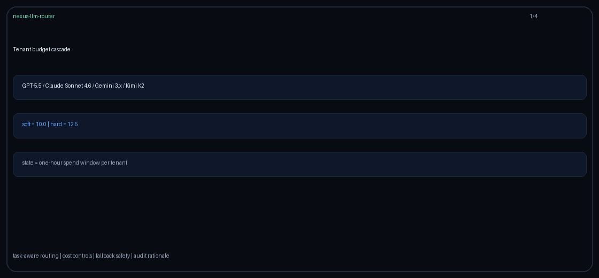

# Tenant-Budget-Cascade Routing Guide

Use `tenant-budget-cascade` to keep each tenant inside a rolling spend envelope
while cascading GPT-5.5 / Claude Sonnet 4.6 / Gemini 3.x / Kimi K2 requests
toward cheaper providers as budget headroom contracts.



## When to use it

- Tenants need independent rolling spend controls.
- Quality-first routing is acceptable while soft-budget headroom remains.
- Requests must shed to a cheaper provider near the ceiling and fail closed
  rather than exceed a hard cap.

## How it works

1. Resolve tenant identity from `metadata.tenant_id`, user, then session.
2. Sum that tenant's successful completion spend over an in-memory one-hour window.
3. Below the soft threshold, choose the highest-quality model whose projected
   request still fits.
4. After soft headroom is exhausted, choose the cheapest model that remains
   below the hard threshold.
5. If even the cheapest request would cross the hard threshold, raise
   `TenantBudgetExceededError` with a fail-closed rationale.

The engine records actual successful completion cost into
`TenantBudgetCascadeStats`; estimates are used only to guard the next decision.

## Quick start

```bash
export NEXUS_DEFAULT_STRATEGY=tenant-budget-cascade
export NEXUS_TENANT_BUDGET_CASCADE_SOFT=10.0
export NEXUS_TENANT_BUDGET_CASCADE_HARD=12.5
```

Or per request:

```http
X-Router-Strategy: tenant-budget-cascade
```
