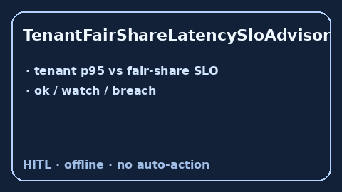

# TenantFairShareLatencySloAdvisor Guide



Offline advisory latency-fairness bands. Closes Helicone / Portkey / LiteLLM
multi-tenant fair-share latency gaps.

Optional polish via **GPT-5.5 / Claude Sonnet 4.6 / Gemini 3.x / Kimi K2**.

Distinct from `FirstTokenLatencySloAdvisor` and `TenantConcurrencySlotGuard`.

## Usage

```python
from safety.tenant_fair_share_latency import TenantFairShareLatencySloAdvisor

advice = TenantFairShareLatencySloAdvisor().advise(
    tenant_id="t1",
    tenant_p95_ms=150.0,
    fair_share_slo_ms=100.0,
)
print(advice.band, advice.ratio)
```
