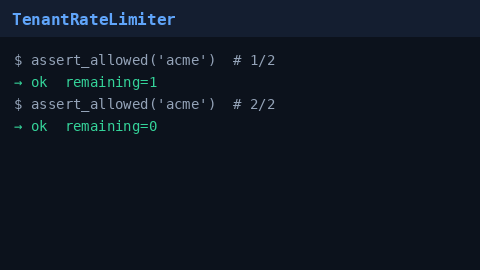

# Tenant Rate Limiter Guide

Hard per-tenant request rate limiting for GPT-5.5 / Claude Sonnet 4.6 /
Gemini 3.x / Kimi K2 traffic. Token-bucket keyed by `tenant_id` — rejects
excess requests before provider dispatch.



## Why

Multi-tenant gateways need a hard ceiling per customer. Soft routing sheds
still forward traffic (to a cheaper model); API-key buckets do not isolate
tenants that share a provider credential. `TenantRateLimiter` closes that gap.

## Distinct from

| Component | Role |
| --- | --- |
| `TokenBucketRateLimiter` | Hard limit keyed by `api_key_id` |
| `token-bucket-tenant` strategy | Soft-sheds noisy tenants to cheaper models |
| `TenantRateLimiter` | Hard reject keyed by `tenant_id` |

## How it works

1. Each tenant gets an independent token bucket (`capacity`,
   `refill_per_second`).
2. `assert_allowed(tenant_id)` consumes one token (or `tokens`) or raises
   `TenantRateLimitExceededError`.
3. `remaining(tenant_id)` reports available tokens after refill (no consume).
4. Thread-safe for concurrent request handlers.

Wire before `/v1/chat/completions` (or in middleware) when you need hard
tenant isolation. Module + tests are sufficient for v1.

## Configuration

```bash
NEXUS_TENANT_RATE_LIMIT_CAPACITY=60
NEXUS_TENANT_RATE_LIMIT_REFILL_PER_SECOND=1
```

## Example

```python
from safety.tenant_rate_limiter import (
    TenantRateLimitExceededError,
    TenantRateLimiter,
)

limiter = TenantRateLimiter(capacity=60, refill_per_second=1.0)
try:
    limiter.assert_allowed("acme")
except TenantRateLimitExceededError:
    # return HTTP 429
    ...
print(limiter.remaining("acme"))
```

## Gap vs Helicone / Portkey

| Capability | Helicone / Portkey | Nexus |
| --- | --- | --- |
| Per-tenant hard rate limit | Yes | `TenantRateLimiter` |
| Soft tenant shed / demote | Yes | `token-bucket-tenant` strategy |
| Per-API-key bucket | Yes | `TokenBucketRateLimiter` |
