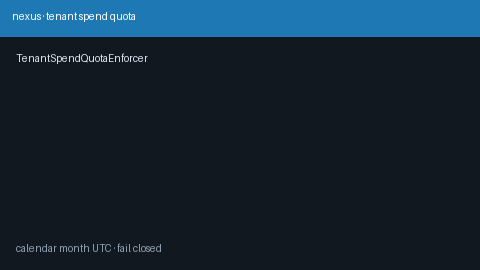

# Tenant Spend Quota Guide

Hard monthly USD spend caps per tenant for GPT-5.5 / Claude Sonnet 4.6 /
Gemini 3.x / Kimi K2 traffic. Built on `SpendLedger` calendar-month windows —
rejects over-quota tenants **before** provider dispatch.



## Why

`SpendLedger` records durable spend, but recording alone does not stop traffic.
LiteLLM virtual-key hard budgets bind to a key secret rather than a tenant's
UTC calendar-month window. `TenantSpendQuotaEnforcer` is the fail-closed gate
that answers: "has this tenant already spent its monthly USD cap?"

## Window

The quota window is the **UTC calendar month** containing `now_fn()`:

`[month_start, next_month_start)`

Spend from prior months does not count. Rolling 30-day windows are intentionally
not used so finance calendars stay aligned.

## Distinct from

| Component | Role |
| --- | --- |
| `SpendLedger` | Durable record + aggregate (`summary`) |
| `BudgetGuard` | In-process subject cap (not monthly / not durable) |
| `VirtualKeyStore` budgets | Per-key secret budget / allowlist |
| `tenant-quota-burst` strategy | Soft/hard *request-count* burst routing |
| `TenantSpendQuotaEnforcer` | Hard monthly USD reject keyed by tenant |

## How it works

1. Construct with a `SpendLedger` (or compatible `summary` source) and
   `monthly_limit_usd > 0`.
2. Optional `now_fn` injects a deterministic clock for tests.
3. `assert_within_quota(tenant)` raises `QuotaExceededError` when spent is at
   or above the monthly limit (fail closed).
4. `remaining(tenant)` / `snapshot(tenant)` report budget left and window bounds
   without mutating state.

Wire the enforcer in front of `/v1/chat/completions` (or middleware) when you
need hard monthly tenant caps. Module + tests are sufficient for v1 — no engine
wiring required.

## Example

```python
from safety.spend_ledger import SpendLedger
from safety.tenant_spend_quota import (
    QuotaExceededError,
    TenantSpendQuotaEnforcer,
)

ledger = SpendLedger("migrations/spend-ledger.sqlite3")
enforcer = TenantSpendQuotaEnforcer(ledger, monthly_limit_usd=100.0)

try:
    enforcer.assert_within_quota("acme")
except QuotaExceededError as exc:
    # return HTTP 429 / 402 with exc.snapshot
    print(exc.snapshot.spent_usd, exc.snapshot.remaining_usd)

print(enforcer.remaining("acme"))
print(enforcer.snapshot("acme"))
```

## Gap vs LiteLLM virtual-key hard budgets

| Capability | LiteLLM virtual keys | Nexus |
| --- | --- | --- |
| Hard USD budget | Yes (per key) | `TenantSpendQuotaEnforcer` (per tenant) |
| Calendar-month window | Varies / key lifetime | UTC calendar month |
| Durable spend source | Key spend counters | `SpendLedger` |
| Fail closed before dispatch | Yes | `assert_within_quota` |
| Frontier model traffic | Yes | GPT-5.5 / Sonnet 4.6 / Gemini 3.x / Kimi K2 |
