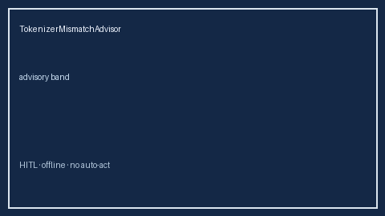

# TokenizerMismatchAdvisor Guide



Closes vLLM / OpenRouter / LiteLLM router-vs-provider tokenizer mismatch bands gaps.

Optional later polish via **GPT-5.5 / Claude Sonnet 4.6 / Gemini 3.x / Kimi K2**.

Distinct from `ToolSchemaDriftGate` and `MultimodalTokenTaxAdvisor`.

## Usage

```python
from safety.tokenizer_mismatch import TokenizerMismatchAdvisor

advice = TokenizerMismatchAdvisor().advise(request_id="r1", mismatch_ratio=0.08)
print(advice.band)
```

## Safety

Advisory only. No HTTP. Humans decide routing changes.
