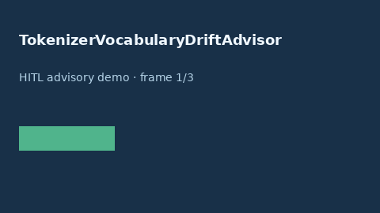

# TokenizerVocabularyDriftAdvisor Guide



Offline HITL advisor. Never network I/O.

Gap vs vLLM/HuggingFace/OpenAI tokenizer vocabulary-drift advisors. Distinct from ``TokenizerMismatchAdvisor`` and ``EmbeddingDimMismatchAdvisor``.

Optional polish via **GPT-5.5 / Claude Sonnet 4.6 / Gemini 3.x / Kimi K2**.

## Usage

```python
from safety.tokenizer_vocabulary_drift import TokenizerVocabularyDriftAdvisor

advice = TokenizerVocabularyDriftAdvisor().advise(request_id="r1", drift_ratio=0.02)
print(advice.band)
```

## Safety

Advisory only. Humans decide routing actions.
