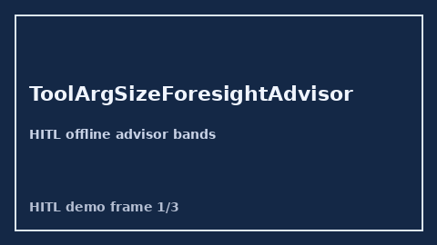

            # ToolArgSizeForesightAdvisor Guide

            

            Closes OpenRouter / LiteLLM / Portkey tool-arg size foresight gaps.

            Optional later polish via **GPT-5.5 / Claude Sonnet 4.6 / Gemini 3.x / Kimi K2**.

            Distinct from `ParallelToolCallArityAdvisor` and `MultimodalPayloadSizeGate`.

            ## Usage

            ```python
            from safety.tool_arg_size_foresight import ToolArgSizeForesightAdvisor

advice = ToolArgSizeForesightAdvisor().advise(request_id="r1", arg_bytes=800, budget_bytes=1000)
print(advice.band, advice.utilization)
            ```

            ## Safety

            Advisory only. No HTTP. Humans decide routing changes.
