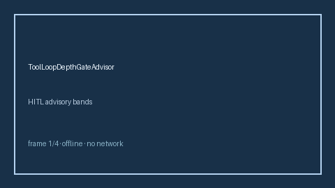

# ToolLoopDepthGateAdvisor Guide



Offline HITL advisor. Never performs network I/O.
Closes gaps vs LiteLLM/vLLM/OpenAI-compatible tool-loop depth gates.

Optional later polish via **GPT-5.5 / Claude Sonnet 4.6 / Gemini 3.x / Kimi K2**.

Distinct from `ToolArgSizeForesightAdvisor` and `ToolSchemaDriftAdvisor`.

## Usage

```python
from safety.tool_loop_depth_gate import ToolLoopDepthGateAdvisor

advice = ToolLoopDepthGateAdvisor().advise(request_id="req-1", loop_depth=3.1)
print(advice.band)
```

## Safety

Advisory bands only. No HTTP. Humans decide. See `SAFETY.md`.
