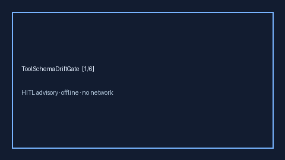

# ToolSchemaDriftGate Guide



Offline advisory tool-schema hash drift bands. Closes OpenRouter / LiteLLM /
Portkey tool-schema drift gaps.

Optional polish via **GPT-5.5 / Claude Sonnet 4.6 / Gemini 3.x / Kimi K2**.

Distinct from `OutputSchemaGuard` and `JsonSchemaRetryAdvisor`.

## Usage

```python
from safety.tool_schema_drift import ToolSchemaDriftGate

advice = ToolSchemaDriftGate().advise(tool_name="search", declared_hash="abc", observed_hash="xyz")
print(advice.band)
```
