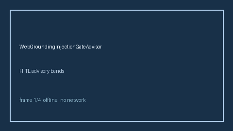

# WebGroundingInjectionGateAdvisor Guide



Offline HITL advisor. Never performs network I/O.
Closes gaps vs Perplexity/Bing/OpenAI web-grounding injection gates.

Optional later polish via **GPT-5.5 / Claude Sonnet 4.6 / Gemini 3.x / Kimi K2**.

Distinct from `PromptInjectionGateway` and `ReasoningTraceLeakAdvisor`.

## Usage

```python
from safety.web_grounding_injection_gate import WebGroundingInjectionGateAdvisor

advice = WebGroundingInjectionGateAdvisor().advise(request_id="req-1", injection_score=0.35)
print(advice.band)
```

## Safety

Advisory bands only. No HTTP. Humans decide. See `SAFETY.md`.
